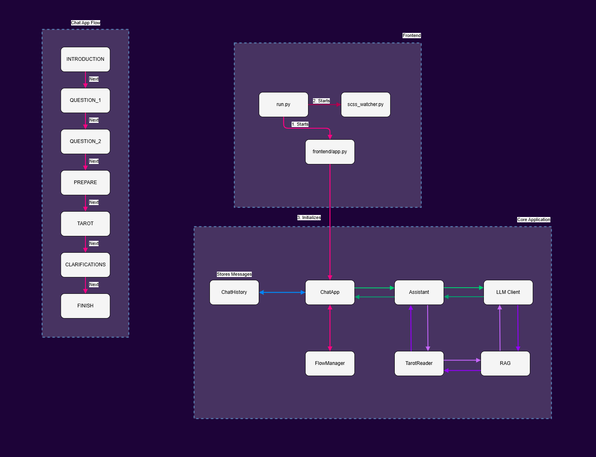

# **LAILA Pythoness 2.0**
### ✨ **Logical AI to Luminous Arcana Pythoness**

LAILA Pythoness actúa como una tarotista profesional 🃏, siempre disponible para realizar consultas de tarot. Su capacidad principal radica en interpretar preguntas formuladas por el usuario/a y ofrecer respuestas basadas en la simbología del tarot Rider-Waite, acompañadas de un toque narrativo y dramatismo.

### ✨ ¿Cómo funciona LAILA Pythoness?

Desarrollada con Python, integra un modelo RAG (Recuperación Aumentada por Generación) y tecnologías modernas como Streamlit para la interfaz y QDrant para la búsqueda semántica .
LAILA está diseñada para realizar tiradas de cartas con un enfoque místico y teatral 🎭. Su propósito es ofrecer una experiencia interactiva y envolvente, capaz de realizar lecturas y responder de manera natural.

Para interactuar con LAILA, simplemente accede a la aplicación web, LAILA te saludará con su personalidad magnética y única. Podrás formular tu pregunta y ella, tras algunas interacciones más, responderá con una tirada e interpretación basada en las cartas extraídas. Esta dinámica permite una experiencia inmersiva y personalizada, donde el usuario siente que está consultando a una tarotista profesional, misteriosa y esotérica.

### ✨ ¿Qué hace especial a LAILA Pythoness?

El aspecto más distintivo de LAILA Pythoness es su enfoque narrativo. Cada interpretación está cuidadosamente elaborada para reflejar un tono teatral 🎭, evocando el estilo de una pitonisa que responde con dramatismo y misterio. Esta narrativa se mantiene coherente a lo largo de todas las interacciones gracias a un sistema de generación de texto basado en un modelo de procesamiento de lenguaje natural (NLP).

### ✨ Conversación
El flujo de la conversación está diseñado de manera secuencial, siguiendo las siguientes fases:

+ INTRODUCTION: LAILA inicia la interacción con un saludo al usuario.

+ QUESTION_1: Se formula la primera pregunta al usuario para conocer su intención o tema de la consulta.

+ QUESTION_2: Se realiza una segunda pregunta para aclarar y profundizar más en la consulta.

+ PREPARE: LAILA se prepara para realizar la tirada de cartas.

+ TAROT: Realización de la tirada de tarot e interpretación de las cartas.

+ CLARIFICATIONS: LAILA ofrece aclaraciones adicionales si el usuario lo requiere.

+ FINISH: Finalización de la sesión con un cierre de la consulta.

### ✨ Gestión del Estado de la Conversación

El modelo utiliza una técnica de persistencia de estado para recordar las interacciones previas durante una sesión. Esto asegura que LAILA pueda mantener una conversación coherente sin perder contexto entre preguntas y respuestas.

### ✨ Guardarraíles
Para mantener a LAILA centrada en su propósito esotérico y evitar desviaciones temáticas, se han implementado restricciones de conversación a nivel de agentes. Si el usuario intenta desviar la conversación a temas ajenos, o introduce texto ininteligible, el modelo responderá con firmeza, redirigiendo la interacción.
LAILA tiene una personalidad muy definida, no hay que tocarle las narices… o “te pondrá dos velas negras” 🕯️🌑🕯️😉.

### ✨ Arquitectura Técnica

```python

LAILA-Pythoness/
│
├── assets/ # Recursos adicionales (para Readme)
│
├── context/ # Documentos de referencia usados en el RAG
│ └── (archivos .pdf y .txt)
│
├── frontend/ # Interfaz gráfica con Streamlit
│ ├── app.py # Punto de entrada de la interfaz
│ ├── scss_watcher.py # Monitorización de estilos SCSS
│ └── static/ # Archivos estáticos como imágenes y estilos
│ ├── css/ # Hojas de estilo CSS compiladas
│ │ └── styles.css
│ ├── scss/ # Archivos fuente SCSS
│ │ └── styles.scss
│ └── img/ # Imágenes para la interfaz
│
├── src/ # Lógica de negocio y procesamiento
│ ├── assistant.py # Gestión de las respuestas del asistente
│ ├── chat_app.py # Control de la conversación
│ ├── chat_history.py # Gestión del historial de conversaciones
│ ├── flow_manager.py # Gestión del flujo conversacional
│ ├── tarot_reader.py # Interpretación de las cartas de tarot
│ ├── llm_client.py # Cliente para modelos de lenguaje
│ ├── rag.py # Implementación del modelo RAG (QDrant)
│ ├── local_document_client.py # Gestión de documentos locales
│ │
│ └── utils/ # Utilidades generales y herramientas de procesamiento
│   ├── document_processor.py # Procesamiento de documentos largos
│   ├── ocr_processor.py # Procesamiento OCR de imágenes
│   ├── pdf-images-to-text.py # Extracción de texto desde PDFs con OCR
│   └── utils.py # Funciones utilitarias generales
│
├── test/ # Pruebas del proyecto (pendiente de contenido específico)
│
├── run.py # Script principal para ejecutar la aplicación
├── requirements.txt # Dependencias del proyecto
├── README.md # Documentación principal
├── .gitignore # Archivos ignorados por Git
└── .env # Configuración de variables de entorno

```
### ✨ Diagrama de flujo



### ✨ Requisitos

+ Python 3.12+
+ Dependencias Python (ver requirements.txt)

### ✨ Instalación

Clonar el repositorio:

```bash
https://github.com/AI-School-F5-P3/LAILA_Pythoness.git
cd laila_pythoness

```

Crear un entorno virtual:

```bash
python -m venv venv
source venv/bin/activate  # En Windows: .\venv\Scripts\activate

```

Instalar dependencias:

```bash
pip install -r requirements.txt

```

Crear el archivo `.env`  y configurar las variables de entorno.

### ✨ Uso

Iniciar la aplicación:

```bash
streamlit run run.py

```

Acceder a la aplicación web en [http://localhost:8501](http://localhost:8501/)

### ✨ Conclusión

LAILA Pythoness demuestra cómo una arquitectura modular puede combinar IA conversacional 🤖 y técnicas de búsqueda semántica 🔍 para ofrecer una experiencia interactiva enriquecida ✨. Su estructura bien definida y la separación de responsabilidades entre frontend y backend facilitan el mantenimiento 🛠️ y la escalabilidad 📈 de la aplicación.

El uso de tecnologías como QDrant y un modelo RAG permite que LAILA acceda a fuentes de conocimiento locales y realice interpretaciones de tarot 🃏🔮 basadas en datos relevantes y contextuales. Esto la convierte en una herramienta poderosa no solo para consultas esotéricas, sino también como un ejemplo de aplicación avanzada de inteligencia artificial 🧠🤖 en el contexto de asistentes virtuales.
